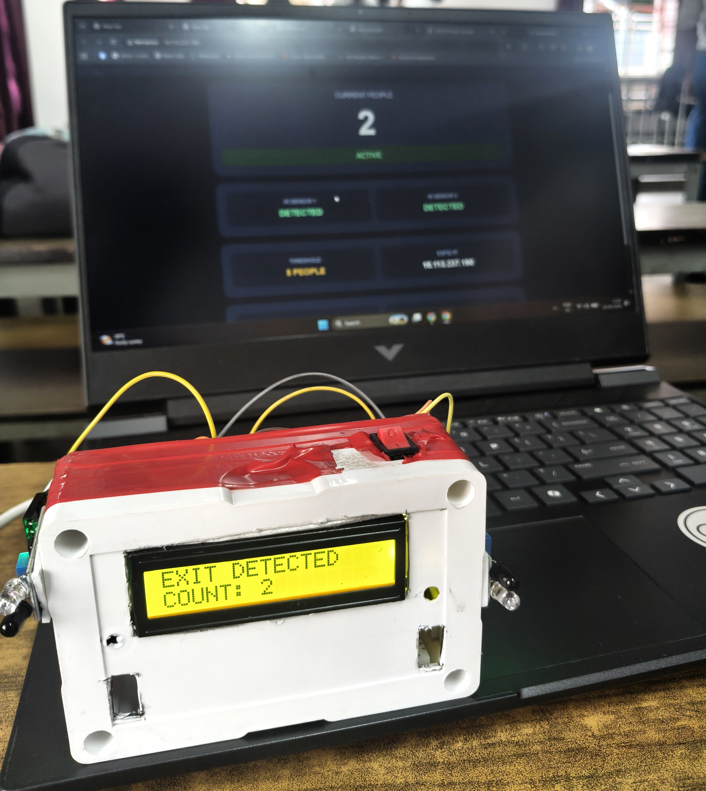
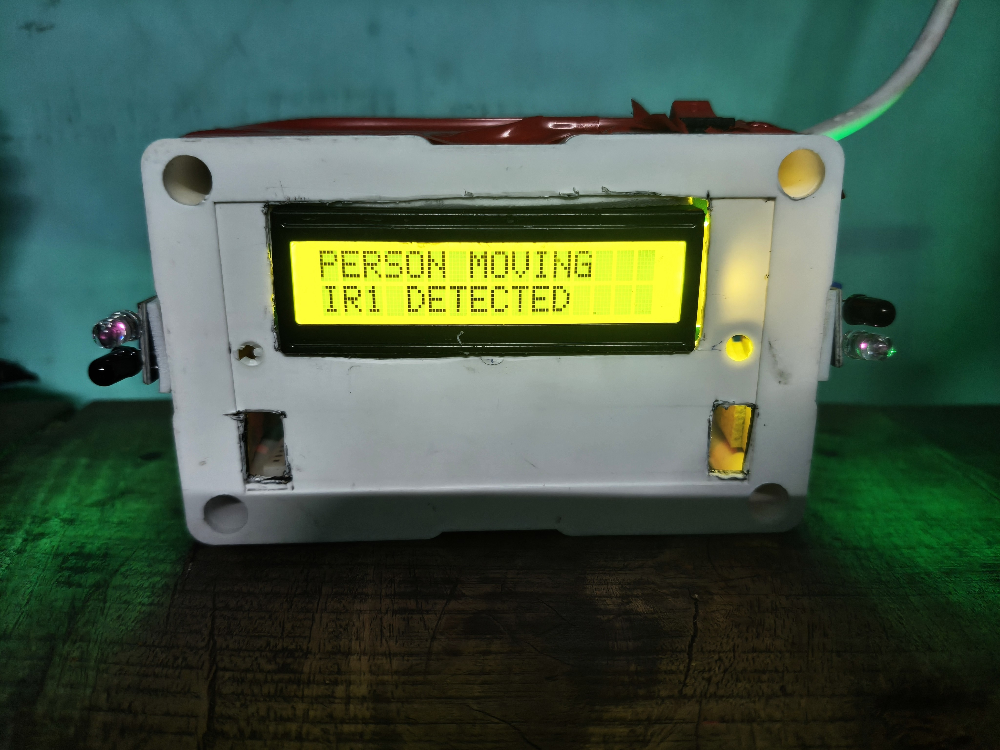
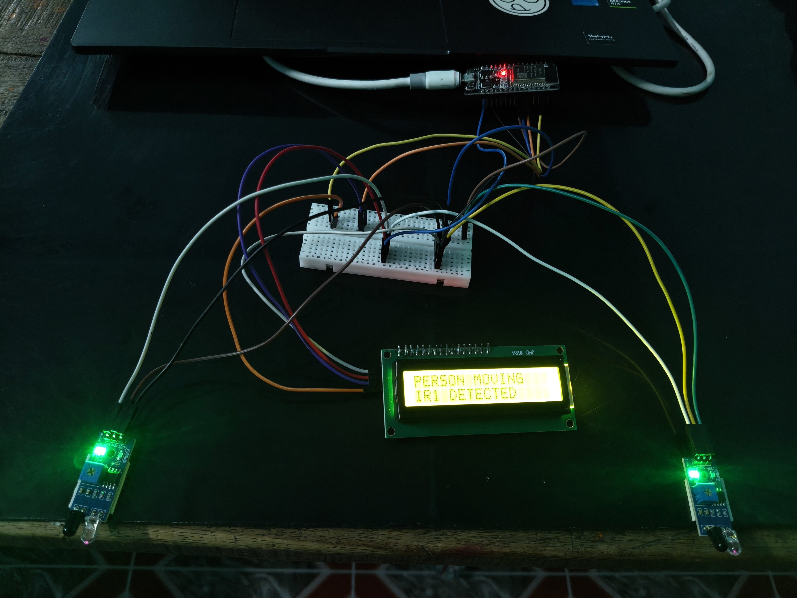
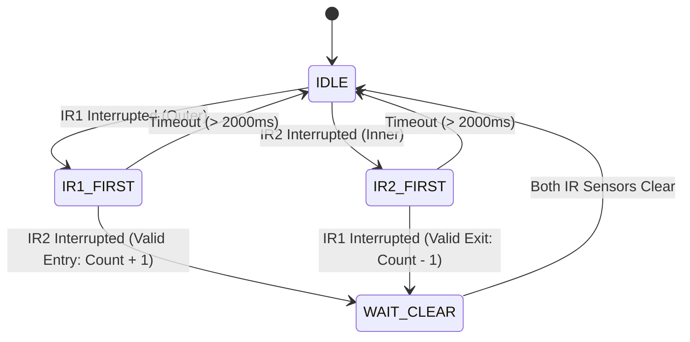

# 🚶‍♂️ Bi-Directional People Counting System
### *IoT-Based Occupancy Monitoring using ESP32 & IR Sensors*

[](https://www.espressif.com/)
[](https://www.freertos.org/)
[]()
[](https://wokwi.com/projects/472173285830632449)
[]()

> Developed as an **Embedded Systems Mini-Project (4th Semester, B.Tech Electrical Engineering)** at **Dr. B. C. Roy Engineering College, Durgapur** under the guidance of **Dr. Tushnik Sarkar**.

---

## 📸 Hardware Prototype & Live Dashboard

<div align="center">
  
  <p><em>Final Wall-Mount Enclosure running alongside the real-time ESP32 Local Web Dashboard</em></p>
</div>

<div align="center">
  
  
  <p><em>(Left) Front view showing I²C LCD & side-mounted IR sensors | (Right) Breadboard prototype during testing</em></p>
</div>

---

## 📌 Overview

The **Bi-Directional People Counting System** is an automated, real-time IoT solution engineered to track indoor occupancy. By utilizing two sequential infrared (IR) beam-break obstacle sensors and an **ESP32 DevKit V4**, the system reliably differentiates between individuals entering and exiting an enclosed room or hallway.

Occupancy data is updated instantaneously on a **16×2 I²C LCD display** and can be served via a **local Wi-Fi web dashboard** hosted directly on the ESP32.

---

## 🚀 Key Features

- **Directional Sequence Logic**: Accurately detects `IR1 ➔ IR2` as an **Entry** (+1) and `IR2 ➔ IR1` as an **Exit** (-1).
- **State-Machine Architecture**: Built with robust finite state machine (FSM) states (`IDLE`, `IR1_FIRST`, `IR2_FIRST`, `WAIT_CLEAR`) preventing accidental or double counts.
- **Debounce & Sequence Timeout Protection**: Filters electrical bounce noise and automatically resets incomplete walk-throughs after 2000 ms.
- **Negative Count Prevention**: Prevents illogical occupancy numbers (ensures count $\ge$ 0).
- **Dual Display Interface**:
  - **Local Hardware Display**: 16×2 LCD with PCF8574 I²C backpack displaying live count and room status (`EMPTY` / `ACTIVE`).
  - **Local Web Dashboard**: Hosted directly via ESP32 Wi-Fi server serving JSON endpoints (`/data`) and live metrics.
- **Ultra Low Cost & Energy Efficient**: Total hardware build cost under **₹1,470 (~$18 USD)**.

---

## 🧠 Working Principle & Logic

```
   [ Entrance / Passage ]
   ----------------------
      [IR1]        [IR2]
   ----------------------
   🚶‍♂️  ➔➔➔➔➔➔➔➔➔➔➔➔➔➔➔➔   ENTRY (IR1 triggered first, then IR2) ➔ Count + 1
   🚶‍♂️  ⬅⬅⬅⬅⬅⬅⬅⬅⬅⬅⬅⬅⬅⬅   EXIT  (IR2 triggered first, then IR1) ➔ Count - 1
```

### State Machine Flow



---

## 🔌 Hardware Connections & Pinout

| Peripheral | Component Pin | ESP32 GPIO | Description |
| :--- | :--- | :--- | :--- |
| **IR Sensor 1 (Outer)** | OUT | `GPIO 18` | Entry trigger point 1 |
| **IR Sensor 2 (Inner)** | OUT | `GPIO 19` | Entry trigger point 2 / Exit trigger point 1 |
| **16x2 LCD (I²C)** | SDA | `GPIO 21` | I²C Data Line |
| **16x2 LCD (I²C)** | SCL | `GPIO 22` | I²C Clock Line |
| **Power Supply** | VCC / GND | `5V` / `GND` | Regulated DC supply (or 18650 Battery Pack) |

---

## 💻 Tech Stack

- **Microcontroller**: ESP32 DevKit V4 (Xtensa Dual-Core 32-bit LX6)
- **Framework / Core**: ESP-IDF / FreeRTOS / Arduino Core
- **Sensors**: Active Infrared (IR) Obstacle Modules
- **Display**: HD44780 16×2 LCD with PCF8574 I²C Adapter
- **IoT / Web**: ESP32 WebServer (Port 80), HTML5, CSS3, JavaScript Fetch API, JSON

---

## 🕹️ Live Simulation & Demonstration

You can test and inspect the full circuit and code simulation in your browser:

🔗 **[Run Wokwi Online Simulation](https://wokwi.com/projects/472173285830632449)**

---

## 📂 Project Structure

```
├── assets/
│   ├── breadboard_circuit_setup.jpeg     # Breadboard prototype during testing
│   ├── prototype_enclosure_front.jpeg    # Front view of enclosed prototype unit
│   └── prototype_with_dashboard.jpeg     # Final prototype with live web dashboard
├── docs/
│   └── Bi-Directional_People_Counting_System_Report.pdf  # 44-page Complete Academic Project Report
├── Workwi circuit simulation.mp4         # Video recording of the live simulation
├── main.c                                # Core ESP32 C / FreeRTOS firmware logic
├── .gitignore                            # Git exclusion rules
└── README.md                             # Documentation & setup guide
```

---

## 👥 Project Team & Credits

**Department of Electrical Engineering, Dr. B. C. Roy Engineering College, Durgapur**

| Sl. No. | Student Name | University Roll No. | Major Contribution |
| :---: | :--- | :---: | :--- |
| 1 | **Tushar Roy** | `120016244066` | System development, web dashboard, firmware programming & testing |
| 2 | **Debayan Laha** | `120016244021` | Sensor interfacing, hardware implementation & documentation |
| 3 | **Chanchal Bhattacharjee** | `120016244019` | Project planning & documentation |
| 4 | **Debasish Dutta** | `120016244020` | Hardware assembly & software support |
| 5 | **Sanchalak Samanta** | `120016244042` | Documentation support & analysis |
| 6 | **Siddhartha Dey** | `120016244067` | Testing & presentation support |

**Project Supervisor**: **Dr. Tushnik Sarkar** (Asst. Professor, Dept. of Electrical Engineering)  
**Head of Department**: **Dr. Shibendu Mahata** (Associate Professor, Dept. of Electrical Engineering)

---

## 📄 License
This project is open-source under the [MIT License](LICENSE).
